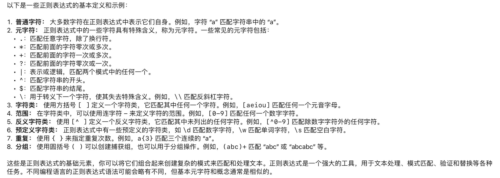

#### 剑指offer20. 表示数值的字符串

##### 请实现一个函数用来判断字符串是否表示数值（包括整数和小数）。请实现一个函数用来判断字符串是否表示数值（包括整数和小数）。

```
有效数字 （按顺序）可以分成以下几个部分：
若干空格
一个 小数 或者 整数（可选）
一个 'e' 或 'E' ，后面跟着一个 整数若干空格

小数 （按顺序）可以分成以下几个部分：
（可选）一个符号字符（'+' 或 '-'）
下述格式之一：
至少一位数字，后面跟着一个点 '.'
至少一位数字，后面跟着一个点 '.' ，后面再跟着至少一位数字
一个点 '.' ，后面跟着至少一位数字

整数 （按顺序）可以分成以下几个部分：
（可选）一个符号字符（'+' 或 '-'）
至少一位数字

部分有效数字列举如下：["2", "0089", "-0.1", "+3.14", "4.", "-.9", "2e10", "-90E3", "3e+7", "+6e-1", "53.5e93", "-123.456e789"]
部分无效数字列举如下：["abc", "1a", "1e", "e3", "99e2.5", "--6", "-+3", "95a54e53"]

给你一个字符串 s ，如果 s 是一个 有效数字 ，请返回 true 。
```

#### 题解:正则表达式

##### 正则表达式定义:



该题正则表达式:

```
String regex = "^[\\s]*[+-]?(\\d+(\\.\\d*)?|\\.\\d+)([eE][+-]?\\d+)?\\s*";

\\[\s]*：匹配零个或多个空白字符。双反斜线 (\) 是 Java 的转义符。
```

##### 正则表达式匹配

```
Pattern pattern = Pattern.compile(regex);
Matcher matcher = pattern.matcher(s);
```
