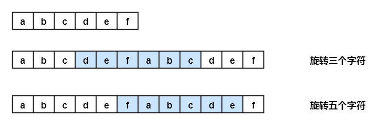

#### 剑指Offer58-II.左旋转字符串

```
找出数组中重复的数字。
在一个长度为 n 的数组 nums 里的所有数字都在 0～n-1 的范围内。数组中某些数字是重复的，但不知道有几个数字重复了，也不知道每个数字重复了几次。请找出数组中任意一个重复的数字。

示例 1：
输入：
[2, 3, 1, 0, 2, 5, 3]
输出：2 或 3 
```

#### 方法一:调库, substring()后拼接, 很垃圾

#### 方法二: 复制字符串拼接,旋转n个即为从第n+1个元素输出原数组长度



```
public String reverseLeftWords(String s, int n) {
        int len = s.length();
        s += s;
        return s.substring(n, n + len);
    }
```
