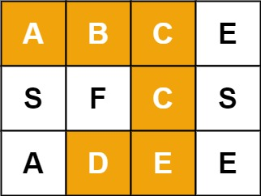

## 剑指offer12. 矩阵中的路径

#### 题目描述

---

设计一个函数，用来判断在一个矩阵中是否存在一条包含某字符串所有字符的路径。路径可以从矩阵中的任意一个格子开始，每一步可以在矩阵中向左，向右，向上，向下移动一个格子。如果一条路径经过了矩阵中的某一个格子，则该路径不能再进入该格子。



```
示例 1：
Input：grid = [["A","B","C","E"],["S","F","C","S"],["A","D","E","E"]], target = "ABCCED"
Output：true

示例 2：
Input：grid = [["A","B","C","E"],["S","F","C","S"],["A","D","E","E"]], target = "SEE"
Ontput：true

示例 3：
Input：grid = [["A","B","C","E"],["S","F","C","S"],["A","D","E","E"]], target = "ABCB"
Output：false
```

#### 题解

---

使用深度优先搜索（DFS），即回溯算法。

回溯算法通过探索所有可能的候选解来找出所有的解的算法。如果候选解被确认不是一个解的话（或者至少不是最后一个解），回溯算法会通过在上一步进行一些变化来舍弃该解，即回溯并且试图找出其他可能的候选解。

```
   public boolean exist(char[][] board, String word) {
        int rows = board.length;
        int cols = board[0].length;
        //使用了额外的 visited 数组来记录哪些节点被访问过
        boolean[][] visited = new boolean[rows][cols];
        for (int i = 0; i < rows; i++) {
            for (int j = 0; j < cols; j++) {
                if (dfs(board, word, 0, i, j, visited)) {
                    return true;
                }
            }
        }
        return false;
    }

    private boolean dfs(char[][] board, String word, int index, int x, int y, boolean[][] visited) {
        if (index == word.length()) {
            return true;
        }
        if (x < 0 || x == board.length 
            || y < 0 || y == board[0].length 
            || visited[x][y] || board[x][y] != word.charAt(index)) {
            return false;
        }
        visited[x][y] = true;
        if (dfs(board, word, index + 1, x + 1, y, visited)
            || dfs(board, word, index + 1, x - 1, y, visited)
            || dfs(board, word, index + 1, x, y + 1, visited)
            || dfs(board, word, index + 1, x, y - 1, visited)) {
            return true;
        }
        visited[x][y] = false;
        return false;
    }
```
