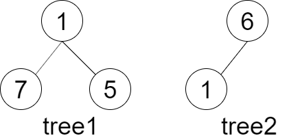
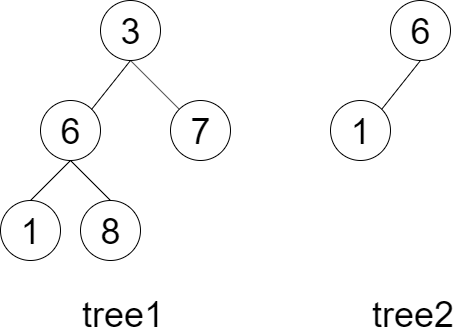

## 剑指offer26. 树的子结构

#### 题目描述

---

给定两棵二叉树 `tree1` 和 `tree2`，判断 `tree2` 是否以 `tree1` 的某个节点为根的子树具有 **相同的结构和节点值** 。
注意，**空树 **不会是以 `tree1` 的某个节点为根的子树具有 **相同的结构和节点值** 。

示例1：



```
Input：tree1 = [1,7,5], tree2 = [6,1]
Output：false
```

示例2：



```
Input：tree1 = [3,6,7,1,8], tree2 = [6,1]
Output：true
```

#### 题解

---

判断B是否是A的子结构，首先需要找到A中与B的根节点相同的节点R，然后再判断A中以R为根节点的子树是否包含B。

1. 如果A当前节点值与B的根节点值相同，进一步判断A的当前子树与B是否有相同的结构；
2. 如果结构不同或值不同，则进一步在A的左子树和右子树中继续寻找；
3. 如果B为null，返回true，表示B已经遍历完了，都能在A中找到；
4. 如果A为null或A的当前节点值与B的当前节点值不同，返回false；
5. 递归判断A的左子树和B的左子树，以及A的右子树和B的右子树。
   ```
   public boolean isSubStructure(TreeNode A, TreeNode B) {
           if(A == null || B == null) return false;
         
           //return isSame(A, B) || isSame(A.left, B) || isSame(A.right, B);
           return isSame(A, B) || isSubStructure(A.left, B) || isSubStructure(A.right, B);
       }
     
       public boolean isSame(TreeNode A, TreeNode B){
           if(B == null) return true;
           if(A == null || A.val != B.val) return false;
         
           return isSame(A.left, B.left) && isSame(A.right, B.right);
       }
   ```
