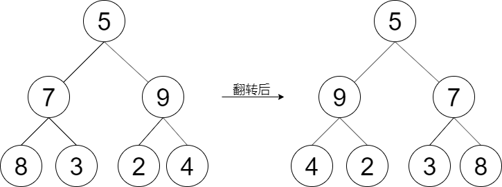

## 剑指offer27. 二叉树的镜像

#### 题目描述

---

给定一棵二叉树的根节点 `root`，请左右翻转这棵二叉树，并返回其根节点。

示例1：

```
Input：root = [5,7,9,8,3,2,4]
Output：[5,9,7,4,2,3,8]
```

#### 题解

---


1. 如果二叉树是空的，则返回空。
2. 交换二叉树的左右子树。
3. 递归地对左子树和右子树应用镜像操作。

```
public TreeNode mirrorTree(TreeNode root) {
        if(root == null) return null;
      
        TreeNode tmp = root.left;
        root.left = root.right;
        root.right = tmp;
      
        mirrorTree(root.left);
        mirrorTree(root.right);
      
        return root;
    }
```
