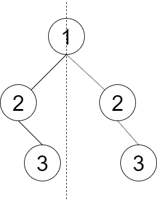

## 剑指offer28. 对称的二叉树

#### 题目描述

---

请设计一个函数判断一棵二叉树是否 **轴对称**

示例1：



```
Input：root = [1,2,2,null,3,null,3]
Output：false
```

#### 方法一：递归

---

对于二叉树的任意两个节点 `L` 和 `R`，如果它们的值相等，并且 `L` 的左子树与 `R` 的右子树对称，`L` 的右子树与 `R` 的左子树对称，那么 `L` 和 `R` 这两棵子树就是对称的。

**本质上是利用 “对称” 定义在「全局」层面上进行检查。**

```
public boolean isSymmetric(TreeNode root) {
        if(root == null) return true;
      
        return isMirror(root.left, root.right);
    }
  
    private boolean isMirror(TreeNode L, TreeNode R){
        if(L == null && R == null) return true;
        if(L == null || R == null) return false;
      
        return (L.val == R.val) && isMirror(L.left, R.right) && isMirror(L.right, R.left);
    }
```

#### 方法二：迭代

---


利用了 “对称” 定义对每层进行检查。

**本质上这是利用 “对称” 定义进行多次「局部」检查。**使用「层序遍历」的方式进行「逐层检查」，对于空节点使用 `emptyNode` 进行代指，同时确保不递归 `emptyNode` 对应的子节点。****

1. 起始时，将 `root` 节点入队；
2. 从队列中取出节点，检查节点是否为 `emptyNode` 节点来决定是否继续入队：在进行流程 **2** 的同时使用「临时列表」记录当前层的信息，并检查当前层是否符合 “对称” 要求；

   * 当不是 `emptyNode` 节点时，将其左/右儿子进行入队，如果没有左/右儿子，则用 `emptyNode` 代替入队；
   * 当是 `emptyNode` 节点时，则忽略；
3. 在进行流程 **2** 的同时使用「临时列表」记录当前层的信息，并检查当前层是否符合 “对称” 要求；
4. 循环流程 **2** 和 **3**，直到整个队列为空。

   ```
   public boolean isSymmetric(TreeNode root) {
           if (root == null) return true;

           Queue<TreeNode> queue = new LinkedList<>();
           queue.add(root.left);
           queue.add(root.right);

           while (!queue.isEmpty()) {
               TreeNode left = queue.poll();
               TreeNode right = queue.poll();

               if (left == null && right == null) {
                   continue;
               }

               if (left == null || right == null || left.val != right.val) {
                   return false;
               }

               queue.add(left.left);
               queue.add(right.right);
               queue.add(left.right);
               queue.add(right.left);
           }

           return true;
       }
   ```
