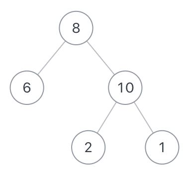

## 剑指offer32.1 从上往下打印二叉树

#### 题目描述

---

不分行从上往下打印出二叉树的每个节点，同层节点从左至右打印。例如输入{8,6,10,#,#,2,1}，如以下图中的示例二叉树，则依次打印8,6,10,2,1(空节点不打印，跳过)，请你将打印的结果存放到一个数组里面，返回。

    

```
示例1
Inout：{8,6,10,#,#,2,1}
Output：[8,6,10,2,1]

示例2
Input：{5,4,#,3,#,2,#,1}
Output：[5,4,3,2,1]
```

#### 方法一：层序遍历（BFS/广度优先遍历）

---

```
/**
 * Definition for a binary tree node.
 * public class TreeNode {
 *     int val;
 *     TreeNode left;
 *     TreeNode right;
 *     TreeNode(int x) { val = x; }
 * }
 */
class Solution {
    public int[] levelOrder(TreeNode root) {
        Queue<TreeNode> queue = new LinkedList<>();
        List<Integer> result = new ArrayList<>();
        if(root == null) {
            return new int[0];
        }
        queue.add(root);
    
        while(!queue.isEmpty()){
            int levelSize = queue.size();
        
            for (int i = 0; i < levelSize; i++) {
                TreeNode currentNode = queue.poll();
                result.add(currentNode.val);

                if (currentNode.left != null) {
                    queue.add(currentNode.left);
                }
                if (currentNode.right != null) {
                    queue.add(currentNode.right);
                }
            }
        }

        int[] output = new int[result.size()];
        for (int i = 0; i < result.size(); i++) {
            output[i] = result.get(i);
        }

        return output;
    }
}
```

#### 方法二：DFS

---


递归不是层序遍历二叉树的常规方法。我们可以使用递归函数，按层和从左到右的顺序访问每个节点。

首先需要计算树的高度，以便知道有多少层。

之后通过递归函数，它接受当前的层级和节点作为参数，并按层级访问所有节点。

```
    public List<List<Integer>> levelOrder(TreeNode root) {
        List<List<Integer>> result = new ArrayList<>();
        int height = getHeight(root);
  
        for (int i = 1; i <= height; i++) {
            List<Integer> currentLevel = new ArrayList<>();
            getLevelOrder(root, i, currentLevel);
            result.add(currentLevel);
        }
        return result;
    }

    private void getLevelOrder(TreeNode node, int level, List<Integer> currentLevel) {
        if (node == null) {
            return;
        }

        if (level == 1) {
            currentLevel.add(node.val);
        } else {
            getLevelOrder(node.left, level - 1, currentLevel);
            getLevelOrder(node.right, level - 1, currentLevel);
        }
    }

    private int getHeight(TreeNode node) {
        if (node == null) {
            return 0;
        }
        return Math.max(getHeight(node.left), getHeight(node.right)) + 1;
    }
```
