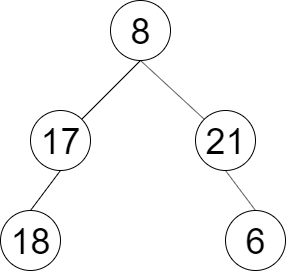

## 剑指offer32.2  把二叉树打印成多行

#### 题目描述

---

与上题类似，

给定一个节点数为 n 二叉树，要求从上到下按层打印二叉树的 val 值，同一层结点从左至右输出，每一层输出一行，将输出的结果存放到一个二维数组中返回。



```
Inout：root = [8,17,21,18,null,null,6]
Output：[[8],[17,21],[18,6]]
```

#### 题解：BFS

---

```
public List<List<Integer>> levelOrder(TreeNode root) {
        Queue<TreeNode> queue = new LinkedList<>();
        //List<List<Integer>> levels = new ArrayList<>();
        //List<int[]> result = new ArrayList<>();
        List<List<Integer>> result = new ArrayList<>();
  
        if(root == null) {
            return result;
        }
        queue.add(root);
  
        while(!queue.isEmpty()){
            int levelSize = queue.size();
            List<Integer> currLevel = new ArrayList<>();
  
            for (int i = 0; i < levelSize; i++) {
                TreeNode currentNode = queue.poll();
  
                currLevel.add(currentNode.val);

                if (currentNode.left != null) {
                    queue.add(currentNode.left);
                }
                if (currentNode.right != null) {
                    queue.add(currentNode.right);
                }
            }
  
            result.add(currLevel);
        }
  
        //for(List<Integer> level : levels){
        //     result.add(level.stream().mapToInt(Integer::intValue).toArray());
        //}
        return result;
  
    }
```
