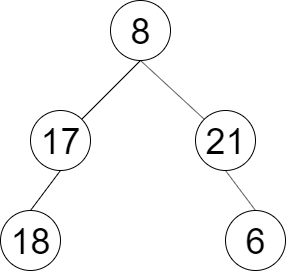

## 剑指offer32.3 按之字形顺序打印二叉树

#### 题目描述

---


请实现一个函数按照之字形打印二叉树，即第一行按照从左到右的顺序打印，第二层按照从右至左的顺序打印，第三行按照从左到右的顺序打印，其他行以此类推。



```
Input：root = [8,17,21,18,null,null,6]
Output：[[8],[21,17],[18,6]]
```

#### 题解

---

用一个标志位来跟踪当前行是奇数还是偶数。

在偶数行时，使用集合工具类 `Collections.reverse()`来反转那一行的输出。

```
public List<List<Integer>> levelOrder(TreeNode root) {
        Queue<TreeNode> queue = new LinkedList<>();
        //List<List<Integer>> levels = new ArrayList<>();
        //List<int[]> result = new ArrayList<>();
        List<List<Integer>> result = new ArrayList<>();
  
        if(root == null) {
            return result;
        }
        queue.add(root);
        boolean isOddLevel = true;
  
        while(!queue.isEmpty()){
            int levelSize = queue.size();
            List<Integer> currLevel = new ArrayList<>();
  
            for (int i = 0; i < levelSize; i++) {
                TreeNode currentNode = queue.poll();
  
                currLevel.add(currentNode.val);

                if (currentNode.left != null) {
                    queue.add(currentNode.left);
                }
                if (currentNode.right != null) {
                    queue.add(currentNode.right);
                }
            }
  
            if(!isOddLevel){
                Collections.reverse(currLevel);
            }
  
            result.add(currLevel);
  
            isOddLevel = !isOddLevel;
        }
  
        //for(List<Integer> level : levels){
            //result.add(level.stream().mapToInt(Integer::intValue).toArray());
        //}
        return result
    }
```
