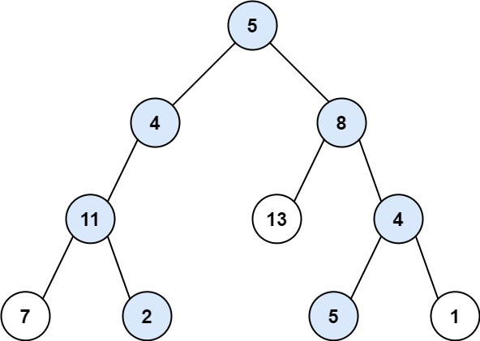

## 剑指offer34. 二叉树中和为某一值的路径

#### 题目描述

---

给出二叉树的根节点 `root` 和一个整数目标和 `targetSum` ，找出所有 **从根节点到叶子节点** 路径总和等于给定目标和的路径。

示例：



```
Input：root = [5,4,8,11,null,13,4,7,2,null,null,5,1], targetSum = 22
Output：[[5,4,11,2],[5,8,4,5]]
```

#### 方法一: DFS

通过深度优先搜索（DFS）和回溯来找出所有从根节点到叶子节点的路径，使得路径上的节点值之和等于目标值

* 如果当前节点是null，直接返回。
* 将当前节点的值加入当前路径 `curr`。
* 检查当前节点是否是叶子节点（即左右子节点都是null）并且其值等于剩下的目标值。如果条件满足，就找到了一条满足条件的路径，将当前路径添加到 `res`中。
* 否则，继续递归访问左子节点和右子节点，目标值减去当前节点的值。
* 回溯：将当前节点的值从当前路径中移除，以便用于下一条可能的路径。这一步是回溯算法的核心，用于撤销之前的选择，寻找其他可能的路径。

  ```
  public List<List<Integer>> pathSum(TreeNode root, int target) {
          List<List<Integer>> res = new ArrayList<>();
          List<Integer> cur = new ArrayList<>();

          dfs(root, target, cur, res);

          return res;
      }

      private void dfs(TreeNode node, int target, List<Integer> curr, List<List<Integer>> res){
          if(node == null) return;

          curr.add(node.val);
          if(node.left == null && node.right == null && node.val == target){
              res.add(new ArrayList<>(curr));
          }else{
              dfs(node.left, target - node.val, curr, res);
              dfs(node.right, target - node.val, curr, res);
          }


          curr.remove(curr.size() - 1);
      }
  ```

  ---

#### 方法二: BFS

---

**1. 主函数：**`b`

* **执行过程：**
  * 首先检查根节点是否为 null，如果是，则返回一个空的结果列表。
  * 初始化三个队列：`nodeQueue` 用于存储待访问的树节点，`sumQueue` 用于存储到达当前节点的路径和，`pathQueue` 用于存储当前的路径。
  * 向三个队列中分别添加根节点，根节点的值和包含根节点值的路径。
  * 使用一个循环，当 `nodeQueue` 不为空时，继续执行循环体内的操作。

**2. 循环体内操作**

* **执行过程：**

  * 弹出 `nodeQueue` 的前端节点为当前节点，同时获取该节点对应的路径和和路径。
  * 判断当前节点是否是叶子节点并且其路径和是否等于目标值。如果满足条件，将当前路径添加到结果列表中。
  * 如果当前节点有左子节点，将左子节点、新的路径和（当前路径和+左子节点的值）、新的路径（当前路径+左子节点的值）分别添加到三个队列的末尾。
  * 同样的操作也对右子节点执行。
  * 循环继续直到 `nodeQueue` 为空。

```
public List<List<Integer>> pathSum(TreeNode root, int target) {
        List<List<Integer>> result = new ArrayList<>();
        if (root == null) return result;

        Queue<TreeNode> nodeQueue = new LinkedList<>();
        Queue<Integer> sumQueue = new LinkedList<>();
        Queue<List<Integer>> pathQueue = new LinkedList<>();

        nodeQueue.add(root);
        sumQueue.add(root.val);
        pathQueue.add(Collections.singletonList(root.val));

        while (!nodeQueue.isEmpty()) {
            TreeNode currentNode = nodeQueue.poll();
            int currentSum = sumQueue.poll();
            List<Integer> currentPath = new ArrayList<>(pathQueue.poll());

            // 如果是叶子节点并且路径和等于目标值，则添加到结果列表中
            if (currentNode.left == null && currentNode.right == null && currentSum == target) {
                result.add(currentPath);
            }

            if (currentNode.left != null) {
                nodeQueue.add(currentNode.left);
                sumQueue.add(currentSum + currentNode.left.val);

                List<Integer> newPath = new ArrayList<>(currentPath);
                newPath.add(currentNode.left.val);
                pathQueue.add(newPath);
            }

            if (currentNode.right != null) {
                nodeQueue.add(currentNode.right);
                sumQueue.add(currentSum + currentNode.right.val);

                List<Integer> newPath = new ArrayList<>(currentPath);
                newPath.add(currentNode.right.val);
                pathQueue.add(newPath);
            }
        }

        return result;
    }
```
