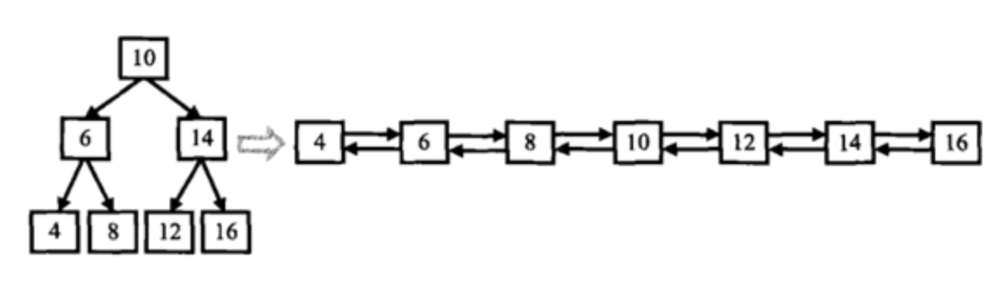

## 剑指offer36. 二叉搜索树与双向链表

#### 题目描述

---

输入一棵二叉搜索树，将该二叉搜索树转换成一个排序的双向链表。如下图所示。要求不能创建任何新的结点，只能调整树中结点指针的指向。



```
示例1：
输入：root = [4,2,5,1,3] 
输出：[1,2,3,4,5]

示例2：
输入：root = [2,1,3]
输出：[1,2,3]

示例3：
输入：root = []
输出：[]
```

#### 题解：中序遍历

---

使用深度优先搜索进行中序遍历，来保证节点顺序是升序的。

定义双向链表节点，它与二叉搜索树的节点相似，但有两个指针，一个指向前一个节点，一个指向后一个节点。

然后，使用中序遍历，当我们访问到一个节点时，我们将其转化为双向链表的节点，并将其接在上一个访问的节点后面

```
class Solution {
    Node head,pre;
    public Node treeToDoublyList(Node root) {
        if(root == null) return null;
      
        dfs(root);
        head.left = pre;
        pre.right = head;
      
        return head;
    }
  
    private  void dfs(Node cur){
        if(cur == null) return;
      
        dfs(cur.left);
      
        if(pre != null){
            pre.right = cur;
        }else{
            head = cur;
        }
      
        cur.left = pre;
        pre = cur;
        dfs(cur.right);
    }
}
```
