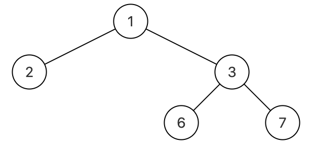

## 剑指offer37. 序列化二叉树

#### 题目描述

---

序列化是将一个数据结构或者对象转换为连续的比特位的操作，进而可以将转换后的数据存储在一个文件或者内存中，同时也可以通过网络传输到另一个计算机环境，采取相反方式重构得到原数据。

请设计一个算法来实现二叉树的序列化与反序列化。这里不限定你的序列 / 反序列化算法执行逻辑，你只需要保证一个二叉树可以被序列化为一个字符串并且将这个字符串反序列化为原始的树结构



```
示例1：
输入：root = [1,2,3,null,null,4,5]
输出：[1,2,3,null,null,4,5]

示例 2：
输入：root = []
输出：[]

示例 3：
输入：root = [1]
输出：[1]

示例 4：
输入：root = [1,2]
输出：[1,2]
```

#### 题解

---

无论使用何种遍历方式，主要是对空节点有所表示

序列化

* 使用深度优先搜索（DFS）的前序遍历方法来遍历二叉树。
* 遍历时，如果遇到一个非空节点，就将节点的值转换为字符串，并加上一个逗号作为分隔符，添加到 `StringBuilder`对象中。
* 如果遇到一个空节点，就添加一个特殊字符（这里使用 `#`）加上逗号到 `StringBuilder`中，表示这里没有子节点。

反序列化使用队列辅助结构。

每次从队列中取出一个元素，判断其值：* 如果是 `#`，表示这个位置是空的，应该返回 `null`。

* 如果不是 `#`，则创建一个新的 `TreeNode`，其值为当前元素的值，并递归地构建其左右子树。

  ```
      private void buildString(TreeNode node, StringBuilder sb){
          if(node == null){
              sb.append("#").append(",");
          }else{
              sb.append(node.val).append(",");
              buildString(node.left, sb);
              buildString(node.right, sb);
          }
      }

      private TreeNode buildTree(Queue<String> nodes) {
          String val = nodes.remove();
          if (val.equals("#")) return null;
          else {
              TreeNode node = new TreeNode(Integer.valueOf(val));
              node.left = buildTree(nodes);
              node.right = buildTree(nodes);
              return node;
          }
      }

      public String serialize(TreeNode root) {
          StringBuilder sb = new StringBuilder();
          buildString(root, sb);
          return sb.toString();
      }

      public TreeNode deserialize(String data) {
          Queue<String> nodes = new LinkedList<>();
        
          nodes.addAll(Arrays.asList(data.split(",")));
          return buildTree(nodes);
      }
  ```
