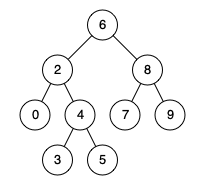

## 剑指offer68.I 二叉搜索树最近公共祖先

#### 题目描述

---

给定一个二叉搜索树, 找到该树中两个指定节点的最近公共祖先



```
示例 1:
输入: root = [6,2,8,0,4,7,9,null,null,3,5], p = 2, q = 8
输出: 6 
解释: 节点 2 和节点 8 的最近公共祖先是 6。

示例 2:
输入: root = [6,2,8,0,4,7,9,null,null,3,5], p = 2, q = 4
输出: 2
解释: 节点 2 和节点 4 的最近公共祖先是 2, 因为根据定义最近公共祖先节点可以为节点本身。
```

#### 题解

---

利用平衡二叉树的性质

利用 p 和 q 与根节点值的比较情况来确定 p 和 q 可能存在的位置：

* 如果 p 和 q 的值都小于根节点的值，说明 p 和 q 都在根节点的左子树中，所以递归处理左子节点；
* 如果 p 和 q 的值都大于根节点的值，说明 p 和 q 都在根节点的右子树中，所以递归处理右子节点；
* 否则，说明 p 和 q 分别在根节点的两侧（一个在左子树，一个在右子树），或者其中一个就是根节点，所以当前根节点就是它们的最低公共祖先。

```
public TreeNode lowestCommonAncestor(TreeNode root, TreeNode p, TreeNode q){
        if(root == null || root == p || root == q) return root;
    
        if(p.val < root.val && q.val < root.val){
            return lowestCommonAncestor(root.left, p, q);
        }
    
        if(p.val > root.val && q.val > root.val){
            return lowestCommonAncestor(root.right, p ,q);
        }
    
        return root;
    }
```
